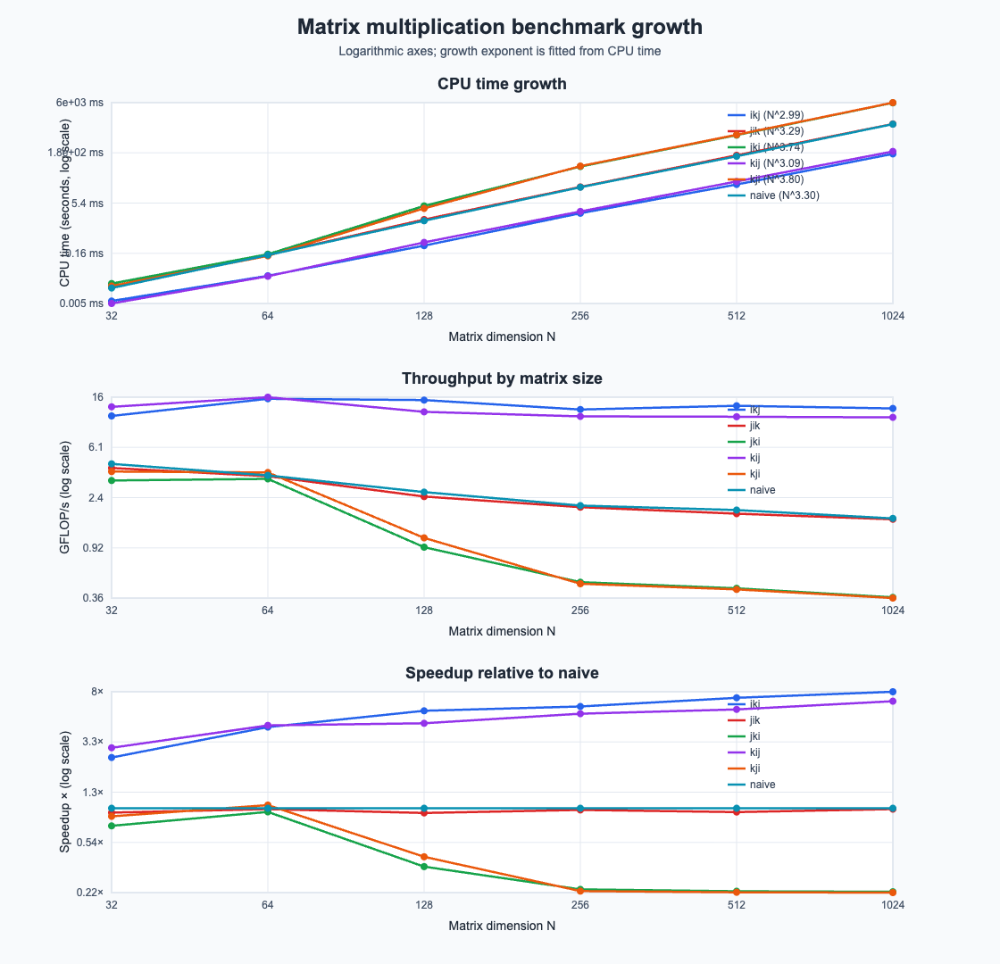

# Optimizations

What are the optimizations, and why/how do they work??

## First, the naive implementation

Naive implementation iterates first over the first dimension of the first matrix, then over the second dimension of the second matrix, then over the shared dimension.
This ends up being pretty slow because we have poor access patterns around memory, and we aren't able to use the cache effectively, or cache values ourselves.

Reordering the loops can make our throughput, clock speed, and cache usage a lot more effective, or even worse! Running

```
./build/matmul_bench --all-implementations --all-metrics \
  --benchmark_filter='.*N:512.*
```

gives us a quick glance. Running in ikj order os by far the most efficient. It takes the fewest cycles, has the highest effective bytes/second, most flops/s, and uses the fewest instructions. Below is a comparison of some of the benchmarks for all of our loop-reordered implementations. Note the logarithmic scale.



ikj being the most efficient is pretty interesting to look at. The reason is that we can (1) cache one of our fetch operations, which is common for our re-orders. What makes it
faster than the other re-orders though is that it allows us to walk through memory very quickly and efficiently. These matrices are storied in contiguous memory, and this 
loop ordering lets us walk through pages of memory by moving just 1 address at a time both for fetching from the second matrix and for writing to the memory addresses for the
results matrix. This is as efficient as it gets!

There are lots of better ways that we can utilize the cache and take advantage of parallelism, which we'll explore in the upcoming implementations.

## Cache-aware blocking/tiling

I didn't know what this was at first! Now I do though. The core idea is that the processor only has so much space on the cache. To make operations quicker and more efficient, we
can break them into blocks that fit on the CPUs L1 or L2 cache, that way we don't have to make long fetches across the computer, everything can stay close to each other.

Being cache-aware means that we measure the cache beforehand so we can optimize for the specific cache of the CPU.

The total size of a tile can't exceed the capacity of our cache, which makes intuitive sense. 

Below is the output from `sysctl -a | grep cache` (note that i'm using this command and not computing cache size or using a different command since I'm on an M3 Mac):

```
hw.perflevel0.l1icachesize: 196608
hw.perflevel0.l1dcachesize: 131072
hw.perflevel0.l2cachesize: 16777216
hw.perflevel1.l1icachesize: 131072
hw.perflevel1.l1dcachesize: 65536
hw.perflevel1.l2cachesize: 4194304
hw.cacheconfig: 8 1 4 0 0 0 0 0 0 0
hw.cachesize: 3699228672 65536 4194304 0 0 0 0 0 0 0
hw.cachelinesize: 128
hw.l1icachesize: 131072
hw.l1dcachesize: 65536
hw.l2cachesize: 4194304
```

I'm opting to just get the cache sizes and hardcode the values in my function for simplicity. For the scope of this project, there's no need to compute it on the fly.

From the results, we can see that I have a 128KB L1 Data Cache and a 16MB L2 Cache, and 128-byte cache line size. The code calculates block/tile size for L1 and L2 cache.

You may notice that there are 2 implementations for cache-aware tiling. That's because we'll be blocking into L1 cache only, and also L1 and L2 cache. Using both caches is even more efficient, because 